# Introduction

This is the source code to the group call app where you can create public or invite-only rooms to chat with other people. The app itself is simple and easy enough to use, nothing too fancy. ‘Behind the scene’ though it is hell as I define it. The idea for the app came to me when my friend asked me, *‘Can you build a clone of the zoom app?’*. *‘Can I?’*, I asked myself (spoiler, I didn’t make it). In the last final project for the CS50x course, I build a twitter-like Django app which was also simple. I thought to myself, I need to make it better and different than that. I have to push myself harder if I wanna test my skills and grow my knowledge. So for this reason I need to build something new and also you guys mentioned not copy previous projects.

So yeah anyway, this app is not best or perfect at all. I mean it has many security issues and there are still lots of bugs lurking in the shadows or midst of giant code hell. But at least I am proud of it!

# Overview of the project

The main technology I used here to pull off the group calling app are Django, React, and WebRTC. There are also respective dependencies for each technology I used, like in Django I used DRF(Django Rest Framework) and Django Channels(a Web-socket framework for Django), with WebRTC I used a wrapper named *‘simple-peer’* package by Feross and in React I used many small libraries like Formik, Yup, Axios and more to ease my life while I code. Well, kind of eased my life. I mean I will ignore the part I had to read through every documentation to understand these libraries and packages.

As you can guess my back-end was Django which was mainly for APIs that were generated by DRF and for that session-based authentication wasn’t ideal for this project, so I used the *'simple-jwt'* package for my JWT (Jason Web Token) Authentication. As I mentioned above I also used Django Channels, a web-socket framework for Django that helped me send signals between all users in an isolated room. These signals in combination with WebRTC (which I will briefly explain in a moment) enabled me to achieve a browser to browser connection where users can send media data to each other.

As for the front-end, I used React with libraries like Formik for forms, Yup for form validation schema, and Material UI for styling the app and giving that polish feel to it. Axios which was a great replacement for the 'fetch' method in JavaScript, helped me to make those Ajax (Asynchronous JavaScript And XML) requests easily. Most of the functionality was done in React which was divided into many React components. My React app is then compiled to normal HTML, CSS, and JavaScript with the help of Webpack and Babel which is then served by Django through a URL route.

WebRTC is the most difficult technology of all, which was hard to understand and apply to my project, at least for me. I still don't understand it quite. Without looking at google if I answer *'what is WebRTC?'*, well, it is a technology built into JavaScript that allows one user's browser to connect to another user's browser through a protocol, and the connection is persisted between the users without any server involved. I mean you do need a server initially, but after the connection is made server is not involved anymore. The package *‘simple-peer’* was really handy when building this WebRTC group call app. It was a wrapper around WebRTC that simplified most of the complex API that was given by WebRTC to simple API.

# Django

In the root project directory, except the *'frontend'* folder, the rest of the folders and files are part of the back-end i.e. Django.

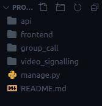

## Folder: *group_call* (*settings.py, wsgi.py, urls.py…*)

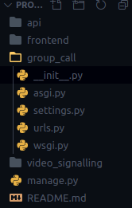

We start from the *'group_call'* folder where the settings file, main urls file, and application reside.

Inside *'group_call/asgi.py'*, the file has been modified by creating a root routing configuration for Channels so that when HTTP requests are made Channels server can receive it through this point.

The *'group_call/urls.py'* has three endpoints. *‘admin/’* route takes to the admin section of the site, *‘api/’* takes to api app and finally the last route with a regular expression is for the front-end where the compiled version of React is served.

In the *'group_call/settings.py file'*, I have added some custom configuration at the bottom of the file. Some of the configurations are like setting static file directory, some DRF related configurations, setting custom user model as default user model and some channels specific settings. In the *'INSTALLED_APPS'* along with third-party apps, I have included two apps in this project which are *‘api’* (API endpoint created with DRF) and *‘video_signaling’* (Django Channel’s consumers)

## Folder: *api* (API App)

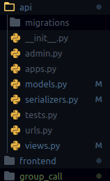

The *'api'* folder handles the task like creating room models, authentication for users, serializers, and so on.

In *'api/models.py'* I have created a custom *'User'* model that uses the *'email'* field as a way to authenticate user instead of *‘username’* and because of this, I needed to update *'UserManager'* class and *'UserAdmin'* class. Then below that, I also created the *'Room'* model which is used for group video call. The fields in the *'Room'* model are pretty self-explanatory. We have the *'titles'* and *‘description’* fields and also the **'type_of'* field so that room can be categorized as open or invite-only. We have a field for *‘user’* which connects the User model via a foreign key and finally a *‘created_on’* field for when the room was created.

The *'api/serializers.py'* is where all JSON serializing and deserializing of model happens. Since I am using JWT authentication to authenticate the user, I have made two serializer classes for that purpose. In *'TokenObtainPairSerializer'* class, I modified the *‘get_token’* class method to return *‘full_name’* field (concatenating *‘first_name’* and *‘last_name’* field from *User* model) along with other default JWT data in token. *'RegisterTokenSerializer'* class is used to deserialize user data coming from the front-end during registration and in return, they get serialized user data with JWT token pair (refresh and access tokens) which will be then used to authenticate the user from the front-end. And finally, we have *'RoomSerializer'* class that deals with the *'Room'* model. I also added the *'room_id'* field that generates room id depending upon the room type is open or invite so that can be used in the URL address bar.

In *'api/views.py'*, since I modified the *'TokenObtainPairSerializer'* class by adding the *'full_name’* field, I had to replace the old serializer class in *'TokenObtainPairView'* class with the modified token serializer class. Below that, I have defined *'RegisterAndObtainTokenView'* class that deals with user registration. Depending upon what the user sent, an appropriate response is then given back. Finally, we have *'RoomViewset'* class where all CRUD operation for the *'Room'* model happens. You can also see I override three methods inside the class, *‘get_queryset’*, *‘get_permissions’* and *‘destroy’* as follows. *‘get_queryset’* method is modified in such a way that by default its gonna return a list of all rooms with the recently created room at the top but if search query param is given, its gonna return list matching that param. I wanted to show the list of rooms even if the user is not logged-in but when they make a post request to create a room, the permission is restricted to the logged-in user only, so *‘get_permission’* is modified in such a way to deal with this. Since I don’t want one user to delete another user room, so in the *‘destroy’* method I made sure that didn’t happen as it compares the user id of the room with the user id that came from decoding the JWT token of that user in the request header.

Finally, in *'api/urls.py'* file, I defined all the API endpoints. CRUD endpoints for the rooms are defined by *'DefaultRouter'* that is given by DRF which out of the box gives endpoint to *‘rooms/’* and *‘rooms/int:room_id’*. Below that we have *‘user/create/’* endpoint for registration, followed by *‘token/’* endpoint that generates token pair (refresh and access token), *‘token/refresh/’* endpoint to refresh *'access token'* if it gets expired and *‘token/verify/‘* endpoint is used to verify the token is valid or not.

## Folder: *video_signalling* (App to used for the signaling process of WebRTC)

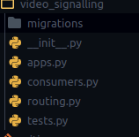

This folder holds all the logic that the user uses to sent signals for WebRTC between each other. It also keeps track of how many users joined in any specific room. This app does not hold many files. Only *'video_signalling/routing.py'* and *'video_signalling/consumers.py'* is important here.

Let's start with *video_signalling/routing.py*. Just like *'urls.py'* for HTTP protocol the *'routing.py'* is used to expose web-socket endpoint. You can see in the file there is only one path that is defined with a regular expression path and this path take a dynamic value as the room name.

*'video_signalling/consumers.py'* file has only one giant class *'VideoConsumer'* that inherits from *'AsyncWebsocketConsumer'* (which makes all the task asynchronous) that deals with web-socket connect, disconnect, send, and receiving message logic. You can see at the top I defined a class variable, *'USERS_CONNECTED'* which is a list to store user and this variable will be passed to all the users in the room whenever a user connects or disconnects so they store it in there React state. Note that storing user in *'USERS_CONNECTED'* is not the same as adding users to the room which is done in the method *‘connect’* with a special method given by Django Channels. The first three methods *‘connect’*, *‘disconnect’*, and *‘receive’* are like events that happen when a user connects to, disconnect from, or sends messages to the web-socket. The rest of the methods are used to send a group message to all users in the rooms.

*‘connect’* method just creates a room and adds the user who joined into that room while *‘disconnect’* clears user from the room and the class variable *'USERS_CONNECTED'* and sends group message to all the users who are connected to the room.  *‘receive’* method receives a message from a user and in response, a message is fired back to all users in the room depending upon what the message is.

Every time the *'group_send'* method is called (this is the method responsible for sending messages to all users in the room) a corresponding method matching that *‘group_send’* is defined below which just has a *‘send’* method that sends a message to a single user. I am still scratching the surface about Django Channels and clearly, you can see my code is not great and maybe not the right way to go about it. But at least it does the job. Back to the *'receive'* method, as you know data is received from the user through this method. It is then converted to python *'dict'*. This data is checked through an if-else statement to know what type of data arrived. If the type is *‘new_user_joined’* the user is first checked for validity (is the user authenticated) and then every other user is made aware of this user joining in. If the type is an *'offer'* or *'answer'* it just sends the signal back to the user to who the signal was intended. The data also have sender’s and receiver’s *‘user_id’* value in it so that data from one user reaches another user properly. In Django Channels, I didn't know how to send a message to a specific user so I ended up using this method where Channel sends message data along with sender's and receiver's *'user_id'* to all users, and then in React the message is received and checked if the receiver’s *‘user_id’* matches with that currently logged-in user id. This is the basic structure of message data sent back and forth between users through Django Channels:

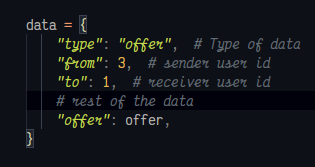

And finally, if the type is *'disconnect'* then everybody is notified about it so they clear related to that user in their React state.

# React

For the front-end as I mentioned I used React with many small libraries. All of the libraries are defined inside the file package.json which is inside the folder frontend.

- *‘react-router-dom’* is used to add route functionality to the app so that the app can be divided into different sections for users to visit.

- *Axios* package is used instead of fetch because it has several API that makes fetching data simpler, like defining a base URL in one place and using it everywhere with just adjusting the endpoint.

- *Formik* and *Yup* packages were used in conjunction to create forms and add validation respectively.

- *‘jwt-decode’* is a small package that I used to decode JWT tokens to extract user info

- *Material UI* for styling the app and also providing mobile responsiveness. Though here in there I used my custom styling to the app.

- Finally, *'simple-peer'*, which is a wrapper for WebRTC APIs. This wrapper was helpful as it made dealing with WebRTC easier and I don't have to worry about a lot of things that I have to do in WebRTC manually.

In the root project directory, the folder *'frontend'* holds all of our React code. Inside this folder, it's a pretty generic React structure.

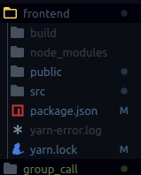

We have a *'frontend/public/'* folder that holds our *'index.html'*, *'frontend/src'* folder with all of React components, and *'frontend/build'* folder where all of the files from *'frontend/public/'*  and *'frontend/src'* directory is compiled to serve in Django. You can also see in *'group_call/settings.py'*, I configured *'STATICFILES_DIRS'* and *'TEMPLATES'* to point to this folder.

*'Index.jsx'* file is inside *'frontend/src'* folder is the usual entry point of the app which renders the *App* component. Inside the *App* component, there is the *Routes* component which then branches to different parts of the app through *'react-router'*. *Routes* component has a lot of important functions of the app. Like loading room lists or loading rooms based on search key given in search bar, the authentication checks whether the user is logged in or not, defining feedback method that is used to give the user feedback about important changes to the app due to user actions.

In the *'frontend/src/components'* folder I divided my application into five parts which then comes together in the Routes component:

- Navigation (*frontend/src/components/navigation_bar*)
- Authentication(*frontend/src/components/authentication*)
- Lobby (*frontend/src/components/lobby*)
- Video Room (*frontend/src/components/video_room*)
- Utilities (*frontend/src/components/utilities*)

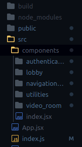

## Utilities

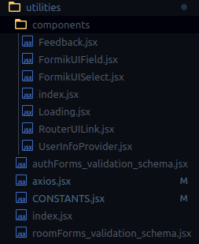

This file holds all of my reusable functions, constants, and components that I used around the app. Here I defined my *Axios* commands with base URL, some constants I keep using across the app like *'AVAILABLE_PATHS'* which is just a bunch of URL routes endpoint. Some *Yup* validation schema for *Formik* forms were also defined that is used around the app like *Login* and *Register* component. And folder components have several reusable components like form fields, loading components, and so on.

## Navigation

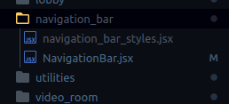

Inside the *NavigationBar* component, the major functionality I provided was the search bar and links to the different endpoint of the app like the login or register page. The navigation bar conditionally changes what it displays depending upon whether a user is logged in or not or what to hide in different routes for example search is only displayed in the lobby route. It also has a plus button defined that opens *'room create form'*. The opening and closing method of the form is defined in the *Routes* component which is the parent component.

## Authentication

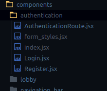

This folder gives two component, *Login* and *Register* component which is used to authenticate the user. Since I am using JWT authentication after a successful login or registration process user receives two tokens which are refresh and access tokens as follows that are then stored in the local storage of the browser. The access token is used in all of the request's header while making GET/POST/PUT/DELETE requests. That way back-end knows is a valid user or not. Then refresh token is used to refresh the access token when it expires. Both the *Login* component and Register component uses *Formik* forms to handle user data submission along with *Yup* validation.  *AuthenticationRoute* component is a wrapper around *Route* component given by '*react-router-dom'* so I can redirect users to lobby if they are already authenticated.

## Lobby

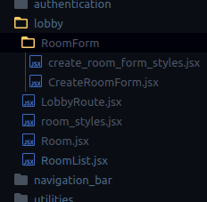

This folder has two important functions. Displaying all rooms and a form to create a new room. Inside there is also a folder *'frontend/src/components/lobby/RoomForm'* which holds the *CreateRoomForm* component. This form is also using *Formik* and *Yup* functionality to submit new room data so a new room can be created. After creating a new room the *Roomlist* is refreshed so that the new room that was created just now is displayed at the top.

The list of rooms is displayed through the *RoomList* component. Each of the rooms is just a single *Room* component. In the file *'Room.jsx'* file is where the *Room* component is defined. Each *Room* component has all detail of the room like Title, description, date, and so on. There is also button like 'Enter' button to enter the room, 'Delete' button to delete it and Copy link button for copying room link for the invite-only room. These buttons are conditionally displayed depending on whether the belongs to the current logged in user or not or whether the room is invite-only or open to all.

## Video Room (and WebRTC)

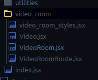

First of all, inside the *'frontend/src/components/video_room'* folder there is a file called *'VideoRoomRoute.jsx'* which is just a wrapper around *Route* from *‘react-router-dom'* so that the user will be redirected to Login if the user is not logged in.

*'VideoRoom.jsx'* file holds all of my WebRTC logic and web-socket logic. Understanding both of the concepts was a bit hard for me and I still don't understand them quite well. The code in this file still sometimes confuses me but I will try to explain what I tried to do here.

When the first user joins the room, the *VideoRoom* component is mounted and the user is immediately connected to Django Channels via web-socket and message is fired storing this user in the Channels (only if the connection was successful) and asked that user for access to their media devices, that is user's webcam and microphone. If the user fails to provide media access then this room shows an error page saying the user can't access this room without media devices. But on success, the user's data from user media is stored in a react state and it is played back to the user through the *Video* component. Nothing else happens until another user joins in, where the same process repeats to the second user except this time this user alerts all the other users (which is the first user) about this user. The new user then creates WebRTC offers for each user in the room and sends them via web-socket (that is, Django Channels). Every user then receives those signals and store them as their RTC remote description and creates a WebRTC answer in response. Which is then sent back to the user who sent the offer initially. The user who initiated the offer then receives the answer and sets that offer to their RTC remote description. Once this process is successfully passed a connection is made between every user in that room and even if the server is turned off the connection will persist. Now since the connection is made each user will be able to see their fellow remote user video on the screen along with theirs in a *Video* component. Users get three buttons at the bottom of their screen to mute/unmute the video, mute/unmute audio and leave the room. Once any user leaves the room everybody is notified about it so that everyone can clear the WebRTC data that is related to the user who just disconnected.

# Closing Thoughts

Phew, that was long. Learning Django and React and all the packages related to these two technologies was a journey for me. WebRTC was the most that gave me troubles. It gave me hard times and I almost gave up on this project just because of this. Many articles were explaining what WebRTC is in theory, and some tutorials on how to make a video call app but none were about Django and React. Sure there were tutorials on how to implement it in React but since I was a complete noob I wanted to know how to implement it with Django step by step. It was so frustrating to understand how to implement it. In the end, it worked. Not the best but worked.

Sorry if I missed out on explaining some of the stuff in projects. But I tried to give as much information as possible. Especially with WebRTC and Django Channels, the implementation is so confusing, it's still hard to explain what exactly happening with these two 'technology' within my code. But that doesn't mean I mindlessly coded it. I learned so much throughout the project and evolved from where I started. And I will just keep getting better understand these concepts in the future.

Thank you.
