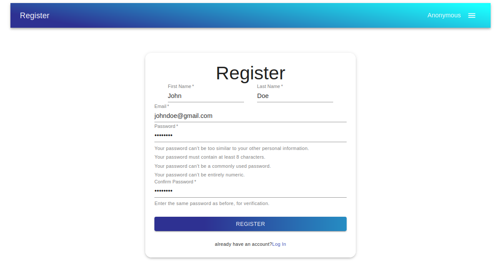
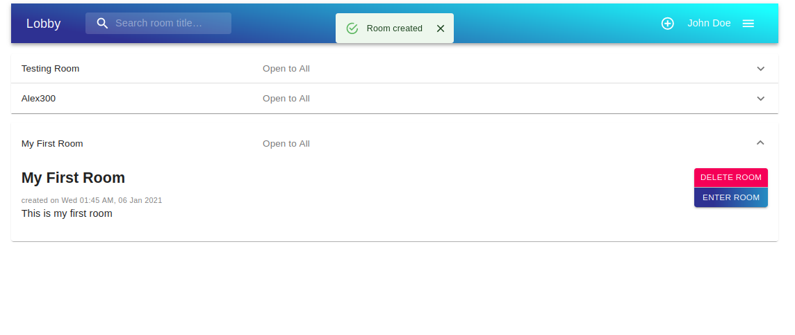

# Group Call App

[**View Live Site**](https://react-django-webrtc-group-video-app.vercel.app/#/)

## About the app

This is one of my early app that I build. The main idea about the app is pretty straight forward, its a group call app. People create public or private rooms to communicate with each other via video. The purpose of making this app was to learn React, Django REST Framework, Websocket and WebRTC. Have no idea what those are? Me neither when I first started, and you don't have to understand it to use this app.

This app was build as a final project for my course in CS50web. There is in depth explanation about the app source code and file structure in 'development-version' branch's [*README.md*](https://github.com/KyrinZero/react-django-webrtc-group-video-app/tree/development-version) file if you wanted to reproduce the app or build your own app based on this or just get an idea how I came to conclusion while building this app. **Warning**, It's pretty long.

## Technology overview

The main technology I used here to pull off this project were React (A front-end library) and Django REST Framework (DRF is a Python based back-end framework). I used these two specifically due to constraints the course gave me. I can only use Django on back-end and any JavaScript framework on front-end. There is also another technology in addition to above technology I used that played a key role in group call feature, that is WebRTC. This technology responsible to connect one user browser to another user for group call.

## Challenges faced building the app

It took around four months to learn and build this app. Before starting this project I didn't have any idea about React, DRF or WebRTC. WebRTC was the biggest hurdle that I faced. In theory its easy to understand what its doing but implementing with Django and React was difficult. Online didn't have good resources explaining how to implement WebRTC specifically with Django and React. I should have first made small todo or chat app to get the feel of the technology. Back of my mind I knew this project will be hard and I will fail several times making this but if I really wanna learn something and grow exponentially I can't go easy. But eventually I made it. 

This app isn't fancy or ground-breaking and for most professional building this will be a breeze. Still this app gave me good feel for most of the concept about building an app such as REST API, authentication, code splitting, code efficiency, UI/UX and more.
