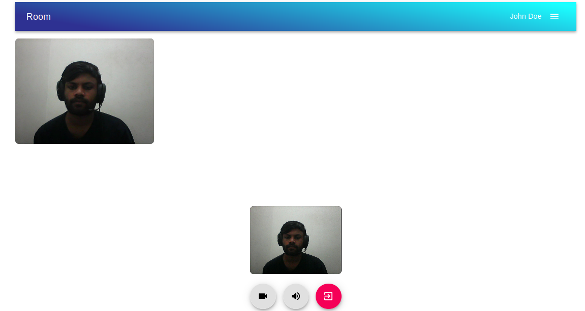

# Group Call App

## In order to run the source code

    (Assuming python and 'pip' is installed)
    pip install -r requirements.txt
    python manage.py makemigrations
    python manage.py migrate
    python manage.py runserver

There is uncompiled version of React code inside the _frontend_ folder but you don't have to compiled it to use the app, as I already compiled it inside _frontend/build_ folder and connected it to Django to serve it through _group_call/urls.py_. The _frontend_ folder is just to review the React part of the code.

## Introduction

This is the source code to the group call app where you can create public or invite-only rooms to chat with other people. The app itself is simple and easy enough to use, nothing too fancy. Behind the scene though, it is a hell or so I define it. The idea for the app came to me when my friend asked me, _‘Can you build a clone of the zoom app?’_. _‘Can I?’_, I asked myself (spoiler, I couldn't). In the last final project for the CS50x course, I build a twitter-like Django app which was also simple. I thought to myself, I needed to make something better and different from that. I have to push myself harder if I want to test my skills and grow my knowledge. So for this reason I need to build something new, and also you guys mentioned not to copy previous projects.

So yeah anyway, this app is not the best or perfect at all. I mean it might have many security issues that I didn't know due to my experience and there might be still lots of bugs lurking in the shadows or midst of giant code hell. But at least it works fine and I am proud of it!

## Overview of the project

The main technology I used here to pull off the group calling app are Django, React, and WebRTC. There are also respective dependencies I used along with these technologies. Like in Django I used DRF(Django Rest Framework) and Django Channels(a Web-socket framework for Django), with WebRTC I used a wrapper named _‘simple-peer’_ package by Feross and in React I used many small libraries like _Formik_, _Yup_, _Axios_ and more, so that my life get easier while I code. Well, kind of easier. I mean I will ignore the part I had to read through every documentation to understand these libraries and packages.

As you can guess my back-end was Django with DRF which was mainly for APIs. For this, session-based authentication wasn’t ideal, so I used the _'simple-jwt'_ package for my JWT (Jason Web Token) Authentication. As I mentioned above I also used Django Channels, a web-socket framework for Django that helped me send signals between all users in an isolated room. These signals in combination with WebRTC (which I will briefly explain in a moment) enabled me to achieve a browser to browser connection where users can send media data to each other.

As for the front-end, I used React with libraries like _Formik_ for forms, _Yup_ for form validation schema, and Material UI for styling the app and giving that polish feel to it. _Axios_ package was a great replacement for the 'fetch' method in JavaScript, that helped me to make those Ajax (Asynchronous JavaScript And XML) requests easily.

Most of the front-end functionality was done in React which was divided into many React components. My React app is then compiled to normal HTML, CSS, and JavaScript inside _frontend/build_ folder with the help of Webpack and Babel which is then served by Django through a URL route.

WebRTC was the most difficult technology of all, which was hard for me to understand and apply to my project. I still don't understand it quite. Without looking at google if I answer _'What is WebRTC?'_, well, it is a technology built into JavaScript that allows one user's browser to connect to another user's browser through a protocol, and the connection is persisted between the users without any server involved. I mean you do need a server initially, but after the connection is made server is not involved anymore. Well my brief explanation was close enough.

The package _‘simple-peer’_ was really handy when building this WebRTC group call app. It was a wrapper around WebRTC that simplified most of the complex API that was given by WebRTC to simple API.

## Django

In the root project directory, except the _'frontend'_ and _'readme_screenshots'_ folder, the rest of the folders and files are part of the back-end i.e. Django.

### Folder: _group_call_ (_settings.py, wsgi.py, urls.py…_)

We start from the _'group_call'_ folder where the settings file, main urls file, and application reside.

Inside _'group_call/asgi.py'_, the file has been modified by creating a root routing configuration for Channels so that when HTTP requests are made, Channels server can receive it through this point.

The _'group_call/urls.py'_ has three endpoints.

- _‘admin/’_ route takes to the admin section of the site,
- _‘api/’_ takes to api app,
- and finally the last route with a regular expression is for the front-end where the compiled version of React is served.

In the _'group_call/settings.py file'_, I have added some custom configuration at the bottom of the file. Some of the configurations are like setting custom static file directory, some DRF related configurations, setting custom user model as default user model and some Channels specific settings. In the _'INSTALLED_APPS'_ along with third-party apps, I have included two apps in this project which are

- _‘api’_ (API endpoint created with DRF),
- and _‘video_signaling’_ (Django Channel’s consumers)

### Folder: _api_ (API App)

The _'api'_ folder handles the task like creating room models, authentication for users, serializers, and so on.

In _'api/models.py'_ I have created a custom _'User'_ model that uses the _'email'_ field as a way to authenticate user instead of _‘username’_ and because of this, I needed to update _'UserManager'_ class and _'UserAdmin'_ class. Then below that, I also created the _'Room'_ model which is used in group video call. The fields in the _'Room'_ model are pretty self-explanatory. We have the _'titles'_ and _‘description’_ fields and also the \*_'type_of'_ field so that room can be categorized as open or invite-only. We have a field for _‘user’_ which connects the User model via a foreign key and finally a _‘created_on’_ field for when the room was created.

The _'api/serializers.py'_ is where all JSON serializing and deserializing of model happens. Since I am using JWT authentication to authenticate the user, I have made two serializer classes for that purpose. In _'TokenObtainPairSerializer'_ class, I modified the _‘get_token’_ class method to return _‘full_name’_ field (concatenating _‘first_name’_ and _‘last_name’_ field from _User_ model) along with other default JWT data in token. _'RegisterTokenSerializer'_ class is used to deserialize user data coming from the front-end during registration and in return, they get serialized user data with JWT token pair (refresh and access tokens) which will be then used to authenticate the user from the front-end. And finally, we have _'RoomSerializer'_ class that deals with the _'Room'_ model. I also added an additional field _'room_id'_ that generates room id depending upon the room type is open or invite so that can be used in the URL address bar.

In _'api/views.py'_, since I modified the _'TokenObtainPairSerializer'_ class by adding the _'full_name’_ field, I had to replace the old serializer class in _'TokenObtainPairView'_ class with the modified token serializer class. Below that, I have defined _'RegisterAndObtainTokenView'_ class that deals with user registration. Depending upon what the user sent, an appropriate response is then given back. Finally, we have _'RoomViewset'_ class where all CRUD operation for the _'Room'_ model happens. You can also see I override three methods inside the class, _‘get_queryset’_, _‘get_permissions’_ and _‘destroy’_ as follows.

_‘get_queryset’_ method is modified in such a way that by default its gonna return a list of all rooms with the recently created room at the top but if search query param is given, its gonna return list matching that param. I wanted to show the list of rooms even if the user is not logged-in but when they make a post request to create a room, the permission is restricted to the logged-in user only, so _‘get_permission’_ is modified in such a way to deal with this. Since I don’t want one user to delete another user room, so in the _‘destroy’_ method I made sure that didn’t happen as it compares the user id of the room with the user id that came from decoding the JWT token of that user in the request header before delete the room.

Finally, in _'api/urls.py'_ file, I defined all the API endpoints. CRUD endpoints for the rooms are defined by _'DefaultRouter'_ that is given by DRF which out of the box gives me endpoint to _‘rooms/’_ and _‘rooms/int:room_id’_. Below that we have _‘user/create/’_ endpoint for registration, followed by _‘token/’_ endpoint that generates token pair (refresh and access token) that is used during login process, _‘token/refresh/’_ endpoint refreshes _'access token'_ if it gets expired and _‘token/verify/‘_ endpoint is used to verify a token is valid or not.

## Folder: _video_signalling_ (App to used for the signaling process of WebRTC)

This folder holds all the logic for the web-socket connection. It also keeps track of how many users joined in any specific room. This app does not hold many files. Only _'video_signalling/routing.py'_ and _'video_signalling/consumers.py'_ are important here.

Let's start with _video_signalling/routing.py_. Just like _'urls.py'_ for HTTP protocol the _'routing.py'_ is used to expose web-socket endpoint. You can see in the file there is only one path that is defined with a regular expression path and this path take a dynamic value as the room name.

_'video_signalling/consumers.py'_ file has only one giant class _'VideoConsumer'_ that inherits from _'AsyncWebsocketConsumer'_ (which makes all the task asynchronous) that deals with web-socket connect, disconnect, send, and receiving message logic. You can see at the top I defined a class variable, _'USERS_CONNECTED'_ which is a list to store users and this variable will be passed to all the users in the room whenever a user connects or disconnects so they store it in their React state and that way all users keep tab of how many users are there in a room.

> Note that storing users in _'USERS_CONNECTED'_ is not the same as adding users to the room which is done in a separate method given by Django Channels inside ‘connect’ method .

The first three methods _‘connect’_, _‘disconnect’_, and _‘receive’_ are like events that happen when a user connects to, disconnect from, or sends messages to the web-socket. The rest of the methods are used to send a group message to all users in the rooms.

_‘connect’_ method just creates a room and adds the user who joined into that room while _‘disconnect’_ clears user from the room and from the class variable _'USERS_CONNECTED'_ and sends a group message by calling _'group_send'_ method to all the users who are connected to the room. In several place of this class I used _'group_send'_ method which is Channels specific method responsible for sending messages to all users in the room. Every time the _'group_send'_ method is called a corresponding method, matching that call is defined below which is just a _‘send’_ method that sends a message to a single user. For example this is how I send data to all user:

and corresponding that value _'new_user_joined'_ which is assigned to key _'type'_ I have this method defined

Hope that makes sense.

_‘receive’_ method receives a message from a user and in response, a message is fired back to all users in the room depending upon what the message is. I am still scratching the surface about Django Channels and clearly, you can see my code is not that great and maybe not the right way to go about it. But at least it does the job. Back to the _'receive'_ method, as you know data is received from the user through this method. It is then converted to python _'dict'_. This data is checked through an if-else statement to know what type of data arrived. If the type is _‘new_user_joined’_ the user is first checked for validity (is the user authenticated), user id is stored in the class variable _'USERS_CONNECTED'_ and then every other user is made aware of this user joining in and updated _'USERS_CONNECTED'_ is passed to all so they can store it in their React state. If the type is an _'offer'_ or an _'answer'_ it just sends the signal back to the user to who the signal was intended for. The data also have sender’s and receiver’s _‘user_id’_ value in it so that data from one user reaches another user properly. In Django Channels, I didn't know how to send a message to a specific user so I ended up using this method where Channel sends message data along with sender's and receiver's _'user_id'_ to all users, and then in React the message is received and checked if the receiver’s _‘user_id’_ matches with that currently logged-in user id. This is the basic structure of message data sent back and forth between users through Django Channels:

And finally, if the type is _'disconnect'_ then everybody is notified about it so they clear data related to that user in their React state.

# React

For the front-end as I mentioned I used React with many small libraries. All of the libraries are listed inside the file package.json which is inside the folder _'frontend'_.

### The main packages used:

- _‘react-router-dom’_ package is used to add route functionality to the app so that the app can be divided into different sections for users to visit.

- _Axios_ package is used instead of fetch because it has several API that makes fetching data simpler, like defining a base URL in one place and using it everywhere with just adjusting the endpoint.

- _Formik_ and _Yup_ packages were used in conjunction to create forms and add validation respectively.

- _‘jwt-decode’_ is a small package that I used to decode JWT tokens to extract user info

- _Material UI_ for styling the app and also providing mobile responsiveness. Though here in there I used my custom styling to the app.

- Finally, _'simple-peer'_, which is a wrapper for WebRTC APIs. This wrapper was helpful, as it made dealing with WebRTC easier and I don't have to worry about a lot of things that I have to do in WebRTC manually.

In the root project directory, the folder _'frontend'_ holds all of my React code. Inside this folder, it's a pretty generic React structure.

We have a _'frontend/public/'_ folder that holds our _'index.html'_, _'frontend/src'_ folder with all of React components, and _'frontend/build'_ folder where all of the files from _'frontend/public/'_ and _'frontend/src'_ directory is compiled to serve in Django. You can also see in _'group_call/settings.py'_, I configured _'STATICFILES_DIRS'_ and _'TEMPLATES'_ to point to this folder.

_'Index.jsx'_ file is inside _'frontend/src'_ folder is the usual entry point of the app which renders the _App_ component. Inside the _App_ component, there is the _Routes_ component which then branches to different parts of the app with the help of _HashRouter_ given by _'react-router-dom'_. _Routes_ component has a lot of important methods for app. Like _loadRooms_ (for loading list of rooms), _handleSearchChanges_ (that calls _loadRooms_ method but with query _param_ which is just the search value from search bar), _authenticateUser_ (the authentication method checks whether the user is logged in or not) and _printFeedback_ (this method is used to send feedback messages to user). There is also methods like _closeRoomForm_, _openRoomForm_ and _closeFeedback_ which is used in conjunction with Material UI package to open and close different UI in the app.

In the _'frontend/src/components'_ folder I divided my application into five parts which then comes together in the Routes component:

- Navigation (_frontend/src/components/navigation_bar_)
- Authentication(_frontend/src/components/authentication_)
- Lobby (_frontend/src/components/lobby_)
- Video Room (_frontend/src/components/video_room_)
- Utilities (_frontend/src/components/utilities_)

## Utilities

This file holds all of my reusable functions, constants, and components that I used around the app.

- _axios.jsx_

  - _getCookie_ method is used to get csrf token from the cookie
  - _axiosInstance_ instance is used make post, get and delete request with baseURL and several header value already defined.
  - _getRoomsList_ is used to get room data from back-end
  - _validateToken_ checks the validity of any token that is passed as argument
  - _refreshingAccessToken_ is used to refresh _'access'_ token

- _CONSTANTS.jsx_

  - _BASE_API_URL_ is just url for the backend api
  - _webSocketUrl_ function returns websocket URL depending upon the HTTP protocol
  - _AVAILABLE_PATHS_ is just all the URL routes
  - _ALL_PATH_TITLES_ is title corresponding to each URL routes defined in _AVAILABLE_PATHS_

- _authForms_validation_schema.jsx_ and _roomForms_validation_schema.jsx_ is validation schema made with _Yup_ package to use in _Formik_ forms.

- Inside _'frontend/src/components/utilities/components'_ all my reusable components live that I use across the app

> There is one component in particular I needed to mention though, that is 'UserInfoProvider' which is a context provider for the whole app so that I can distribute user info (User id and user full name) across the app for easy access. This provider wraps the whole app inside 'Routes' component. The value for the provider is also filled inside 'Routes' with the help of 'authenticateUser' method.

## Navigation

**Note:** You will notice every section there is one file that ends with _'\*\_styles.jsx'_ which is just custom styling used to override Material UI styling for that specific component. So I will ignore those files.

Inside the _NavigationBar_ component, the major functionality I provided was the search bar and links to the different endpoint of the app like the login, register, lobby and video room. It also provides a button that opens _'create room'_ form.

The navigation bar conditionally changes what it displays depending upon whether a user is logged in or not or what to hide in different routes.

- _showComponents_ is responsible for displaying search bar and _'create room form'_ button when the route is _'/lobby'_ only.
- _changePageTitle_ method is use to change the title on the navigation bar depending upon the current route.
- _menuAction_ is used to decide what action to perform whenever any item in the menu is clicked.

These methods is executed in different parts of the _NavigationBar_ components, like in _constructor_ method, life-cycle method like _componentDidMount_ and _componentDidUpdate_ and also in _render_ method menu items are change depending upon user is logged-in or not.

## Authentication

This folder has three components, _AuthenticationRoute_, _Login_ and _Register_ component. _AuthenticationRoute_ component is a wrapper around _Route_ component given by '_react-router-dom'_ so I can redirect users to lobby if they are already authenticated. Both the _Login_ component and Register component are pretty similar and uses _Formik_ forms to handle user data submission along with _Yup_ validation. All these two components does is, gets user data, validates it (shows error if data is invalid) and submits the data through onSubmit function. I used here Material UI styles to show visual feedback of error or success during submission.

Since I am using JWT authentication after a successful login or registration process user receives two tokens which are _'refresh'_ and _'access'_ tokens as follows that are then stored in the local storage of the browser. The access token is used in all of the request's header while making GET/POST/PUT/DELETE requests. That way back-end knows the person who is making a request is a valid user. And refresh token is used to refresh the access token when it expires.

## Lobby

This folder has two important functions. Displaying all rooms and a form to create a new room.

### Display Room list

The list of rooms are displayed through the _RoomList_ component. The data for the rooms list is loaded with the method _loadRooms_ that was defined in _Routes_ component and passed it down to _RoomList_ as props.

Each of the rooms are just a single _Room_ component. In the file _'Room.jsx'_ is where the _Room_ component is defined. Each _Room_ component has details of the room like Title, description, date, and so on. There is also button like 'Enter' button to enter the room, 'Delete' button to delete it and Copy link button for copying room link for the invite-only room. These buttons are conditionally displayed depending on whether the room belongs to the current logged-in user or not or whether the room is invite-only or open to all. The enter and delete button's on-click actions are defined in _RoomList_ component by _enterRoom_ and _deleteRoom_ (this methods just makes DELETE request with _roomId_ as a _param_ value) respectively. Inside Room component two methods were defined which are:

- _copyRoomUrl_ method is an on-click action for Copy link button that just lets you copy room link to your clipboard

- _renderRoomType_ method is just used to covert room type initials to readable text, for example 'OTA' to 'Open to all'

### Create Room Form

Inside _lobby_ folder there is another folder called _'RoomForm'_ which holds the _CreateRoomForm_ component. This is a form which also uses _Formik_ and _Yup_ functionality to submit new room data, so that a new room can be created. This component is used inside _RoomList_, and it is at the top wrapped within _Modal_ component provided by Material UI. This form is hidden by default but whenever the plus button is clicked, that is on navigation bar, this form is displayed as a overlay over the app. This overlay functionality was actually provided by Material UI

The _onSubmit_ function unlike _Login_ and _Register_ is defined in _Roomlist_ component where after creating a new room the _Roomlist_ is refreshed so that the new room that was created just now is displayed at the top.

## Video Room (and WebRTC)

First of all, inside the _'frontend/src/components/video_room'_ folder there is a file called _'VideoRoomRoute.jsx'_ which is just a wrapper around _Route_ from _‘react-router-dom'_ so that the user will be redirected to Login if the user is not logged in.

_'VideoRoom.jsx'_ file holds all of my WebRTC logic and front-end web-socket logic. Understanding both of the concepts was a bit hard for me and I still don't understand them quite well. The code in this file still sometimes confuses me but I will try to explain what I tried to do here.

When the first user joins the room, the _VideoRoom_ component is mounted and the user is immediately connected to Django Channels via web-socket and message is fired storing this user in the Channels (only if the connection was successful) and asked that user for access to their media devices, that is user's webcam and microphone. If the user fails to provide media access then this room shows an error page saying the user can't access this room without media devices. But on success, the user's data from user media is stored in a React state and it is played back to the user through the _Video_ component. Nothing else happens until another user joins in, where the same process repeats to the second user except this time this user alerts all the other users (which is the first user) about this user. The new user then creates WebRTC offers for each users in the room and sends them via web-socket (that is, Django Channels). Every user then receives those signals and store them as their RTC remote description and creates a WebRTC answer in response. Which is then sent back to the user who sent the offer initially. The user who initiated the offer then receives the answer and sets that offer to their RTC remote description. Once this process is successfully passed a connection is made between every user in that room with each other and even if the server is turned off the connection will persist. Now since the connection is made each user will be able to see their fellow remote user video on the screen along with theirs in a _Video_ component. Users get three buttons at the bottom of their screen to mute/unmute the video, mute/unmute audio and leave the room. Once any user leaves the room everybody is notified about it so that everyone can clear the WebRTC data that is related to the user who just disconnected.

Methods inside _VideoRoom_ component:

- _muteVideo_, _muteAudio_ and _leaveRoom_ methods are just as it says.
- _CreatePeer_ creates a _Peer_ object (with help of _'simple-peer'_ package) as initiator and sends signal as an _offer_ to single user with that _Peer_ and returns that _Peer_ for storing in the React state.
- _addPeer_ creates a a _Peer_ object as non-initiator and sets the offer it just received as it's remote description. Then signals back that user with _answer_ and finally returns the a _Peer_ object.
- _sendSignalsToAll_ creates peer for each user in the room and send them offers with the help of _CreatePeer_ method. Then for every _Peer_ object created by method _CreatePeer_, is stored in the React state

_componentDidMount_ life-cycle method is the place user receives messages from the web-socket(Django Channels) and deals with those messages.
Here at first the object _navigator.mediaDevices_ exist or not is being confirmed. Then web-socket connection is attempted to be made. After that _websocket.open_ event is triggered in successful connection and message is fired back that a new user joined the room. Up next, is _websocket.onmessage_ event, that receives messages sent by Channels. Just like Channels _receive_ method the data received is converted to Javascript object and that object is ran against Javascript 'Switch/Case' command to determine what 'type' of data arrived. As I mentioned above the data sent back and forth has three 'keys' in common, that is 'type', 'from'(sender) and 'to'(receiver). Here in this switch command different type of messages are dealt with differently.

if _type_ is equal to:

- **new_user_joined**: User is asked for permission to media devices. And then when user gives the access, the stream object from that media devices is stored in React state and _sendSignalsToAll_ method is called with current user id and that stream as an argument. And if the user joined is not the same as the current user then that user is made aware of the new user by firing _printFeedback_.
- **sending_offer**: If receiver id is equal to current user id then the offer that came is set as that user remote description and _addPeer_ method is fired. The _Peer_ object return from _addPeer_ is stored in state.
- **sending_answer**: If receiver id is equal to current user id then the answer arrived is set as that user remote description and WebRTC connection is made.
- **disconnected**: if the user who disconnected is not the current user then information regarding that user is cleared from that current user's React state.

_componentWillUnmount_ life-cycle method is the place where stream is closed, web-socket connection is closed, all the WebRTC is connection is destroyed and all the states are cleared when a user is leave the room.

_Video_ components is just a video element that plays the stream. This stream might be passed locally or remotely.

# Closing Thoughts

Phew, that was long. Learning Django and React and all the packages related to these two technologies was a journey for me. WebRTC was the most that gave me troubles. It gave me hard times and I almost gave up on this project just because of this. Many articles were explaining what WebRTC is in theory, and some tutorials on how to make a video call app but none were about Django and React. Sure there were tutorials on how to implement it in React but since I was a complete noob I wanted to know how to implement it with Django step by step. It was so frustrating to understand how to implement it. In the end, it worked. Not the best but worked.

Sorry if I missed out on explaining some of the stuff in projects. But I tried to give as much information as possible. Especially with WebRTC and Django Channels, the implementation is so confusing, it's still hard to explain what exactly happening with these two 'technology' within my code. I am really sorry if I couldn't explain it. But that doesn't mean I mindlessly coded it. I learned so much throughout the project and evolved from where I started. And I will just keep getting better at understanding these concepts in the future.

Thank you.
